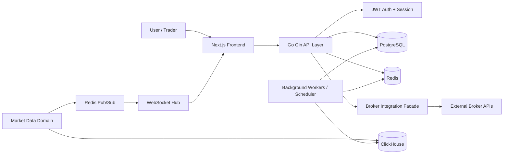

# MarketPulse Pro Architecture

## 1. Executive Summary

MarketPulse Pro is a financial market analytics and trading-workflow platform designed around a Go backend, a Next.js frontend, and a multi-tier data architecture using PostgreSQL, Redis, and ClickHouse. The repository makes it clear that the platform is intended for live market monitoring, options analytics, watchlist workflows, strategy management, and eventual broker-aware trading operations.

This project is not a generic prototype. It is a governance-driven architecture specification backed by explicit decision documents, implementation blueprints, and a live code foundation. The evidence available in the repository describes a coherent architecture baseline with a few key gaps that remain intentionally unresolved:

- broker-specific provider API implementation is pending and explicitly blocked by missing contract definitions
- object storage and Parquet archival decisions are deferred
- the production cloud topology is proposed but not finalised
- the codebase is a foundation with architecture scaffolding rather than a fully completed production environment

This README is intentionally conservative. It reflects what is evidenced in the repository, separates design intent from implementation status, and labels areas that remain unknown or pending as such.

## 2. Source of Truth and Evidence Model

The architecture in this folder is the authoritative design record for the platform. The governing documents include:

- [MASTER_INDEX.md](MASTER_INDEX.md)
- [ARCHITECTURE_MAP.md](ARCHITECTURE_MAP.md)
- [DECISION_REGISTER.md](DECISION_REGISTER.md)
- [TECHNOLOGY_STACK.md](TECHNOLOGY_STACK.md)
- [MICROSERVICE_ARCHITECTURE.md](MICROSERVICE_ARCHITECTURE.md)
- [DEPENDENCY_GRAPH.md](DEPENDENCY_GRAPH.md)
- [DATA_OWNERSHIP_MATRIX.md](DATA_OWNERSHIP_MATRIX.md)
- [EVENT_CATALOG.md](EVENT_CATALOG.md)
- [Volume_3_Enterprise_Architecture.md](Volume_3_Enterprise_Architecture.md)
- [Volume_5_Implementation_Architecture.md](Volume_5_Implementation_Architecture.md)
- [Volume_6_Engineering_Governance.md](Volume_6_Engineering_Governance.md)
- [PHASE4_ARCHITECTURE_ROADMAP.md](PHASE4_ARCHITECTURE_ROADMAP.md)

The implementation evidence comes from the root project files, especially the Go backend and the Next.js frontend. Where the repository is silent, the document labels the status as either Estimated, Inference, or Unknown / Requires Validation.

## 3. Product Identity

| Item | Evidence-based statement |
|---|---|
| Product name | MarketPulse Pro |
| Product category | Financial market analytics and trading workflow platform |
| Primary purpose | Real-time market monitoring, option-chain analysis, saved views, strategy workflows, and broker-aware trading workflows |
| Target users | Traders, analysts, and advanced market participants |
| Core problem | Market intelligence and analysis are fragmented across data sources, charts, and trading tools |
| Value proposition | Unified view of live market data, option analytics, watchlists, and strategy state with a realtime UX |

## 4. Core Capabilities Supported by Evidence

The repository supports the following capabilities as architecture and implementation intent:

- real-time market data ingestion and distribution
- option-chain and Greeks-related analytics
- user watchlists and saved market views
- strategy-builder workflows and persistent strategy state
- WebSocket-driven live refreshes
- PostgreSQL-backed user and transactional state
- ClickHouse-backed analytics and time-series storage
- Redis-based cache, message transport, and runtime state
- multi-broker abstraction for Zerodha, Angel One, and ICICI Direct UI scope
- modular backend role separation for API, WebSocket, and workers

Important constraint: the specific provider APIs for Zerodha, Angel One, and ICICI Direct are not implemented. They remain pending decisions.

## 5. Architecture Principles

The design set is anchored on the following principles:

1. domain-driven boundaries with a modular monolith structure
2. clean architecture layering in Go
3. PostgreSQL as the transactional system of record
4. Redis for cache, state, and Pub/Sub messaging
5. ClickHouse for high-throughput market analytics
6. WebSocket as the primary realtime transport layer
7. role-based execution for API, websocket, and worker workloads
8. governance-first design with explicit decision tracking
9. no unsupported legacy assumptions from earlier MarketPulse work

## 6. Status Summary

| Area | Status | Evidence |
|---|---|---|
| Frontend architecture | Approved | Strong |
| Backend architecture | Approved | Strong |
| Realtime layer | Approved | Strong |
| Core data model boundaries | Approved | Strong |
| Broker API implementations | Pending | Blocked by missing provider contracts |
| Cloud storage provider | Pending / deferred | Not ratified |
| Parquet archival path | Pending / deferred | Not approved |
| Production deployment topology | Pending | Intentionally not finalised |
| Observability baseline | Partial | Implemented at foundation level |

## 7. High-Level Architecture



## 8. Major Components

### Frontend
- Next.js application with a route-based UI model
- user flows covering home, trade, options, watchlists, positions, and profile surfaces
- client-side dashboard behavior with a market-data-rich trading interface

### Backend
- Go application built with Uber Fx
- Gin API layer for HTTP routes
- domain modules for user, watchlist, strategy, market data, and broker workflows

### Data layer
- PostgreSQL for relational data and transactional records
- Redis for in-memory cache and Pub/Sub fanout
- ClickHouse for analytical and time-series data

### Realtime layer
- WebSocket hub with subscription and broadcast behavior
- Redis Pub/Sub as the message distribution path to connected clients

### Operational layer
- background scheduler and worker runtime
- telemetry and logging hooks
- graceful startup and shutdown lifecycle management

## 9. Technology Stack Inventory

| Layer | Technology | Architectural role | Status |
|---|---|---|---|
| Frontend | Next.js + React | Web application and route rendering | Evidenced |
| Frontend state | TanStack Query + Zustand | API and UI state management | Evidenced |
| Backend | Go 1.26.x | Core runtime | Evidenced |
| API | Gin | HTTP server and route handling | Evidenced |
| Dependency injection | Uber Fx | Application lifecycle and composition | Evidenced |
| Config | Viper | Configuration loading | Evidenced |
| Auth | JWT + Go crypto | Auth and token validation | Evidenced |
| Database | PostgreSQL + GORM | Transactional persistence | Evidenced |
| Analytics store | ClickHouse | Historical and analytical time-series storage | Evidenced |
| Cache | Redis | Cache + runtime state + Pub/Sub | Evidenced |
| WebSocket | Gorilla WebSocket | Client realtime transport | Evidenced |
| Event bus | Redis Pub/Sub | Event fan-out | Evidenced |
| Job queue | Asynq | Async workers | Evidenced |
| Scheduler | gocron | Periodic execution | Evidenced |
| Logging | Zap | Structured logs | Evidenced |
| Telemetry | OpenTelemetry | Traces and metrics | Evidenced |
| Monitoring | Prometheus / Grafana | Metrics and dashboards | Documented |
| Containers | Docker Compose | Local dev stack | Evidenced |
| Deployment | Docker, Nginx, EC2, GitHub Actions, systemd | Proposal only, not finalised | Pending |
| Object storage | S3 references | Pending decision | Deferred |
| Data format | Parquet | Pending decision | Deferred |

## 10. Repository Structure

```text
MarketPulse Pro/
├── Architecture/
│   ├── ADR/
│   ├── Phase-1/
│   ├── Phase-2/
│   ├── README.md
│   ├── MASTER_INDEX.md
│   ├── ARCHITECTURE_MAP.md
│   ├── DECISION_REGISTER.md
│   ├── TECHNOLOGY_STACK.md
│   ├── MICROSERVICE_ARCHITECTURE.md
│   ├── EVENT_CATALOG.md
│   ├── DATA_OWNERSHIP_MATRIX.md
│   └── Volume_*.md
├── Backend/
│   ├── cmd/
│   ├── internal/
│   ├── configs/
│   ├── go.mod
│   ├── .env.example
│   └── .gitignore
├── Frontend/
│   ├── src/
│   ├── public/
│   ├── package.json
│   ├── .env.example
│   └── .gitignore
├── Infrastructure/
│   └── docker-compose.dev.yml
├── Deployment/
├── Docs/
├── Scripts/
├── Tests/
├── .gitignore
├── image.png
├── reference/
└── README.md
```

## 11. Backend Architecture

The Go backend is the primary service layer. The implementation evidence shows a modular service layout with domain folders such as auth, user, watchlist, strategy, marketdata, and broker modules. The project uses Uber Fx to compose providers, repositories, services, handlers, and lifecycle hooks.

### Backend responsibilities
- application bootstrap and dependency injection
- HTTP routes and middleware
- JWT-based authentication and authorization checks
- user and strategy persistence in PostgreSQL
- market-data ingestion and normalization
- ClickHouse access for analytical data
- Redis cache and Pub/Sub interaction
- WebSocket hub integration
- scheduler and worker runtime registration

### Runtime decomposition
This architecture follows a modular monolith pattern rather than a pure microservice model. Service responsibilities are separated by module, but the runtime still runs as one logical Go service with role-driven execution.

## 12. Frontend Architecture

The frontend is a Next.js application with a route-driven UI. The project tree includes app routes such as home, authenticated pages, and API-facing endpoints. The architecture implies a trading dashboard with live market pages and option-chain workflows consistent with a Sensibull-style UI reference.

### Frontend characteristics
- Next.js App Router pattern
- React-based component structure
- route groups for public and authenticated states
- state split between server-state caching and client-state management
- dashboard-first layout with options and watchlist workflows

The frontend is expected to consume the backend API and WebSocket layer for live data updates.

## 13. API Architecture

The repository shows an HTTP API structure built around `/api/v1` routes. The patterns are consistent with an authenticated app with user, strategy, marketdata, watchlist, and broker endpoints.

### API families
| Interface | Pattern | Purpose |
|---|---|---|
| Health | `/ping` | liveness check |
| Auth | `/api/v1/auth/*` | login, register, auth flows |
| User | `/api/v1/user/*` | profile and user state |
| Watchlists | `/api/v1/watchlists*` | watchlist CRUD |
| Strategies | `/api/v1/strategies*` | strategy operations |
| Options | `/api/v1/options/chain` | option-chain retrieval |
| Trade options | `/api/v1/trade-options/*` | quote and trading-flow support |
| Broker flows | `/api/v1/broker/*` | broker commands and adapters |
| Internal ingest | `/api/v1/internal/ingest/*` | internal data ingestion |
| WebSocket upgrade | `/ws` | realtime channel upgrade |

### API security and validation
- JWT-based protection is part of the intended auth model
- production configuration checks are explicitly enforced in configuration logic
- secrets are not supposed to be hardcoded in docs or repository files

## 14. WebSocket and Realtime Flow

The WebSocket layer is a first-class component of the runtime architecture. The design uses a hub abstraction with client registration, subscription management, and broadcast fan-out. Redis Pub/Sub is the event backbone feeding updates into the WebSocket layer.

```text
Market Data Source
→ Ingestion / normalization
→ ClickHouse persistence
→ Redis Pub/Sub event publication
→ WebSocket hub / ticket service
→ connected frontend clients
```

This is consistent with the repository’s explicit decision that Redis Pub/Sub is the approved realtime event distribution mechanism.

## 15. Data Architecture

### Data stores
| Store | Role | Why it exists | Access pattern |
|---|---|---|---|
| PostgreSQL | transactional system of record | users, watchlists, strategy/state data | relational, CRUD heavy |
| Redis | cache + Pub/Sub + state | realtime fan-out and short-lived runtime state | high-speed read/write |
| ClickHouse | analytics and time-series store | option data, ticks, derived metrics | analytical queries |

### Data ownership rules
The architecture explicitly separates ownership boundaries:
- PostgreSQL stores user, watchlist, strategy, and order-related records
- ClickHouse stores analytical market series and option-greeks data
- Redis stores runtime cache keys and realtime event namespaces

The project explicitly states that components should not write across domain ownership boundaries.

## 16. Market Data and Historical Data Flow

The architecture supports a clear data lifecycle:

1. data acquisition from external market-source providers
2. ingestion and validation into the data domain
3. normalization and enrichment
4. persistence in ClickHouse for analytical access
5. quick-path distribution through Redis Pub/Sub
6. realtime push into WebSocket subscribers
7. user-level view composition in the frontend

Historical retention and archival remain intentionally designed but not fully finalised. The project mentions Parquet and object storage as pending decisions, which means the deep historical lake strategy is not yet locked in.

## 17. Scheduled Jobs and Background Processing

The repository explicitly includes job queue and scheduler constructs:

- Asynq for asynchronous jobs and worker queues
- gocron for scheduled runtime tasks
- lifecycle hooks to start and stop the ingest service cleanly
- periodic refresher and maintenance tasks as part of the architecture model

This makes the runtime capable of supporting pre-market, intraday, and post-market orchestration stages without requiring immediate full distributed queueing.

## 18. Environment and Local Runtime

The local infrastructure file defines a development-only stack with:

- PostgreSQL on port 5434
- Redis on port 6379
- ClickHouse on ports 8123 and 9000

The environment examples show variables such as:

- `MP_SERVER_PORT`
- `MP_DATABASE_HOST`
- `MP_REDIS_HOST`
- `MP_CLICKHOUSE_HOST`
- `MP_AUTH_JWT_SECRET`
- `MP_MARKETDATA_SENSIBULL_WS_URL`

These are names only; actual secret values are not documented and are intentionally not included in this README.

## 19. Cloud Architecture

The repository does not evidence a final, production-selected cloud deployment. What is clear is that the architecture assumes a cloud-friendly deployment model with container-based application packaging and service-oriented runtime roles.

Evidence-supported concepts:
- Docker-based local development setup
- Nginx and EC2 references in the deployment decision records
- GitHub Actions as a likely CI/CD target
- systemd as a possible service management mechanism

The valid architectural statement is therefore:

> The platform is designed to be deployable in a cloud environment, but the final cloud provider and production topology remain pending approval.

## 20. Deployment Architecture

```text
Developer
→ Git / source control
→ CI pipeline (documented conceptually)
→ build / test / lint
→ release artifact / container image
→ deployment target
→ API / WebSocket / worker runtime
→ monitoring and observability
```

The deployment model is conceptually modern but not finalised. Docker is accepted for local development infrastructure, while production cloud provider, TLS termination, load balancing, and networking details remain pending governance decisions.

## 21. Security Architecture

The architecture includes several security expectations:

- JWT-based auth flows
- middleware-based route protection
- config validation for production-sensitive values
- no hardcoded production secrets in docs or source files
- explicit treatment of broker integrations as isolated provider abstractions

### Secrets handling
The repository includes `.env.example` files and a root `.gitignore` that ignores `.env` files and secret-bearing artifacts. This is the correct approach. Actual secret values are not included here.

## 22. Observability and Reliability

The project includes evidence for:

- structured logs via Zap
- OpenTelemetry tracing hooks
- metrics-related design intent
- graceful shutdown of services and dependencies
- middleware and lifecycle management in the backend

This is a solid baseline for production ops, but it is not yet a fully matured production observability stack with dashboards, alerts, and SLOs defined in the repository.

## 23. Performance, Capacity and Scaling

### Observed
The repository clearly supports:
- concurrent WebSocket activity
- Redis Pub/Sub fan-out
- analytical ClickHouse ingestion
- relational PostgreSQL state persistence
- modular backend separation

### Estimated
These are engineering estimates, not measured production results:
- moderate-to-large market-data workloads are the intended pattern
- performance scale is likely constrained by realtime fan-out and database analytics load
- architecture is designed for a modular monolith rather than a universally distributed system

### Unknown / Requires Validation
- real DAU and peak concurrency
- actual WebSocket connection limits
- database pool behaviour under market hours
- ClickHouse ingestion throughput under live data load
- cache hit ratio and Redis saturation thresholds

## 24. Capacity Planning

| Scenario | Approximate scale | Assumption |
|---|---:|---|
| Small deployment | low hundreds to low thousands | local/limited pilot workloads |
| Moderate deployment | tens of thousands | production-grade but constrained runtime |
| Scaled deployment | design target in the 100k–200k DAU range | according to architecture governance notes |

This target range is an architectural design estimate, not an empirically validated production benchmark.

## 25. Cost Considerations

The repository does not provide vendor-specific pricing, but the major cost categories are evident:

- compute for API, websocket, and worker services
- PostgreSQL hosting
- ClickHouse hosting
- Redis cache hosting
- network and WebSocket throughput costs
- monitoring and telemetry infrastructure
- market-data provider costs
- eventual object-storage costs if archival is enabled

These are variable by deployment target and therefore should be treated as cost drivers rather than fixed commitments.

## 26. Security, Risk, and Failure Modes

### Risks and blockers
| Area | Current state | Impact |
|---|---|---|
| Provider APIs | pending | trading integrations remain blocked |
| Object storage | pending | archival/export strategy incomplete |
| Parquet pipeline | deferred | historical lake strategy incomplete |
| Final cloud topology | pending | deployment details unresolved |
| Production observability | partial | operations maturity still evolving |

### Failure modes
- upstream market-data interruption affects realtime flow
- Redis failure impacts cache and Pub/Sub fan-out
- PostgreSQL issues impact user and strategy state
- ClickHouse ingestion issues affect analytics queries
- WebSocket disconnects require reconnect and subscription re-registration

The platform architecture includes graceful shutdown and retry-friendly patterns, but it does not evidence a complete disaster recovery plan as a final production artifact.

## 27. Architectural Roadmap

### Current architecture
- Go backend with service modules
- Next.js frontend
- PostgreSQL + Redis + ClickHouse stack
- realtime WebSocket bus
- modular monolith with role separation

### Near-term improvements
- finalise the production deployment target
- settle broker provider contracts
- complete observability and alerting design
- add production hardening around retries, timeouts, and circuit breakers

### Medium-term scaling
- reduce hot-path contention on shared services
- tune Redis and database pools
- separate worker and API process roles if needed
- implement deeper historical data lifecycle and archival controls

### Long-term evolution
- larger horizontal scale for API and WebSocket workloads
- stronger event-driven orchestration where demand warrants it
- broader queue-driven background processing
- advanced storage partitioning and analytical retention policies

## 28. Open Questions and Assumptions

### Resolved
- Go backend is the primary service runtime
- Next.js is the frontend platform
- PostgreSQL, Redis, and ClickHouse are the design anchors
- WebSocket and Redis Pub/Sub are the realtime architecture

### Pending or unresolved
- final cloud provider and deployment topology
- final broker API contracts
- object-storage and Parquet archival model
- exact production scale benchmarks
- final monitoring and alert SLAs

## 29. Conclusion

MarketPulse Pro is a serious fintech architecture direction with a disciplined engineering baseline. The repository demonstrates a platform intended for live market data, user workflows, option analytics, and broker-aware trading patterns, using Go, Next.js, PostgreSQL, Redis, ClickHouse, and WebSockets as its primary technical foundation.

The architecture is credible and governed, but it is not yet a complete production deployment. The project clearly distinguishes architectural approval from implementation completion, which is the correct governance posture for a platform of this scope.

This README therefore deliberately reflects the current evidence: what is approved, what is implemented, what is pending, and what must be validated before claiming full production readiness.

## 30. Related Architecture Documents

- [MASTER_INDEX.md](MASTER_INDEX.md)
- [ARCHITECTURE_MAP.md](ARCHITECTURE_MAP.md)
- [DECISION_REGISTER.md](DECISION_REGISTER.md)
- [TECHNOLOGY_STACK.md](TECHNOLOGY_STACK.md)
- [MICROSERVICE_ARCHITECTURE.md](MICROSERVICE_ARCHITECTURE.md)
- [DEPENDENCY_GRAPH.md](DEPENDENCY_GRAPH.md)
- [DATA_OWNERSHIP_MATRIX.md](DATA_OWNERSHIP_MATRIX.md)
- [EVENT_CATALOG.md](EVENT_CATALOG.md)
- [Volume_3_Enterprise_Architecture.md](Volume_3_Enterprise_Architecture.md)
- [Volume_5_Implementation_Architecture.md](Volume_5_Implementation_Architecture.md)
- [Volume_6_Engineering_Governance.md](Volume_6_Engineering_Governance.md)
- [P4-10-CAPACITY-AND-SIZING-DECISION.md](P4-10-CAPACITY-AND-SIZING-DECISION.md)

## Market-Hours Operational Lifecycle

The project’s architecture clearly treats market operations as time-sensitive, but the repository does not define exact clock times in a final production runbook. The documented lifecycle is:

### Pre-market
- auth/session validation
- data initialization and cache warm-up
- option-chain/screener readiness
- user watchlist and strategy dependency hydration

### Market open
- initial ingestion and baseline reference values
- realtime event publication
- frontend subscription activation

### Intraday
- tick and market-data updates
- Redis Pub/Sub propagation
- WebSocket and client refresh
- option-chain/Greek recalculation and analytical persistence

### Market close
- final aggregation and persistence
- historical rollup or archival behavior
- queue drain and cleanup tasks

### Post-market
- background processing
- historical analysis and next-day preparation
- system maintenance and data compaction

## Data Architecture

### Primary data stores

| Store | Purpose | Evidence | Notes |
|---|---|---|---|
| PostgreSQL | Transactional app state | Decision register + code config | User, watchlist, strategy, and orders domain data |
| Redis | Cache + Pub/Sub + state | Architecture docs + code | Real-time bridge and short-lived WS tickets |
| ClickHouse | Analytical market time series | P4-04 and P4-06 governance | Market ticks and option greeks |

### Data ownership
The repository explicitly states that no service should directly write to another domain’s tables. The ownership matrix identifies boundaries such as:

- `users`, `watchlists`, `watchlist_items`, `strategies`, `strategy_legs` in PostgreSQL
- `market_ticks` and `option_greeks` in ClickHouse
- `ws:ticket:*` and event namespaces in Redis

### Data contracts and fields
Observed field patterns from the code and architecture include:

- identifiers and timestamps
- instrument identifiers and symbols
- price, OHLC, volume, open interest, strike, expiry, option type
- Greeks and derived analytics values
- market metadata and event payload envelope fields
- user-specific strategy and watchlist records

The repository intentionally avoids exposing secrets in documentation. Any actual secret material should remain in environment files or secret managers, not in runtime docs.

## API Architecture

The route registration confirms the following API families:

| Interface | Path pattern | Purpose | Status |
|---|---|---|---|
| Health | `/ping` | Basic liveness check | Evidenced |
| Auth | `/api/v1/auth/*` | Register, login, session, logout | Evidenced |
| Broker auth | `/api/v1/auth/broker/:provider/*` | Provider login hooks | Evidenced |
| User | `/api/v1/user/*` | Profile | Evidenced |
| Watchlist | `/api/v1/watchlists*` | User watchlists | Evidenced |
| Strategy | `/api/v1/strategies*` | Strategy CRUD and legs | Evidenced |
| Options | `/api/v1/options/chain` | Option-chain data | Evidenced |
| Trade options | `/api/v1/trade-options/*` | Intraday and quotes | Evidenced |
| Broker commands | `/api/v1/broker/*` | Broker integration and order flows | Evidenced |
| Internal ingest | `/api/v1/internal/ingest/*` | Internal market data ingestion | Evidenced |
| WebSocket upgrade | `/ws` | Upgrade endpoint | Evidenced |

## WebSocket Architecture

The WebSocket layer has a dedicated hub abstraction with:

- client registration and unregistration
- dynamic channel subscriptions
- broadcast fan-out by channel
- connection health and drop handling

The architecture indicates that Redis Pub/Sub is the event bus feeding the WebSocket hub; this allows efficient distribution of market events to many active clients without each client directly connecting to all upstream sources.

## Cloud Architecture

The architecture documents do not show a final production cloud deployment as fully ratified. What is supported by evidence is the following:

- Local development infrastructure is defined via Docker Compose
- The architecture references Docker, Nginx, EC2, GitHub Actions, and systemd as possible deployment components
- The cloud object-store decision remains pending
- The production topology is intentionally not locked to a single provider in the current repository state

Therefore, the valid statement is:

> The architecture is designed for cloud deployment and modular scaling, but the final production cloud provider and deployment topology remain pending approval.

## Deployment Architecture

The repository sets up the path for a modern deployment pipeline, but it does not show a commercial production deployment as complete.

```text
Developer
→ Git / repo changes
→ CI pipeline (documented conceptually)
→ build / lint / test
→ container or service packaging
→ deployment target
→ API / WebSocket / worker process
→ runtime monitoring
```

The project explicitly mentions Docker and Nginx in deployment documentation, but this should be treated as an approved dev/infrastructure concept rather than fully validated production topology.

## Security Architecture

The repository documents strong governance expectations for security, including:

- JWT for auth
- internal API key for internal endpoints
- middleware-based route protection
- sensitive config validation in production mode
- explicit requirement to avoid hardcoded secrets
- no secret values should be committed to docs or source control

The config loader enforces production validation for internal API keys and Angel One configuration, which is evidence of a security-by-default posture.

## Observability and Reliability

Observed observability features include:

- structured logging via Zap
- telemetry hooks using OpenTelemetry
- metrics counters around WebSocket activity
- graceful shutdown for all major runtime dependencies

This is a sound starting point for production operations, but it should be treated as architectural scaffolding rather than a fully matured production monitoring stack.

## Performance, Capacity, and Scalability

### Observed
The repository clearly supports:

- concurrency-aware WebSocket hub logic
- Redis-based pub/sub fan-out
- ClickHouse for analytical ingestion
- PostgreSQL for transactional correctness
- dedicated role-based service execution model

### Estimated
A reasonable engineering estimate is that the architecture is designed to support moderate-to-large market-data workloads, but the repository does not provide measured production load results. The expected growth pattern is driven by:

- active WebSocket connections
- tick ingestion rate
- number of watchlists and strategy records
- analytical aggregation cost
- cache hit ratio
- machine and network resource size

### Unknown / Requires Validation
- actual DAU
- peak per-second request rate
- real WebSocket concurrency limits
- database and ClickHouse load under production market hours
- cache and broker rate-limit behavior

## Capacity and Usage Estimates

The project documents a target of 100,000–200,000 DAU for the modular monolith design, but this should be treated as design intent, not as a measured production claim.

| Scenario | Approx. users | Assumption |
|---|---:|---|
| Small deployment | Low hundreds to low thousands | Local dev or pilot workloads |
| Moderate deployment | Tens of thousands | Small production cluster with tuned caches and DB pools |
| Scaled deployment | 100k–200k DAU target | Architectural design target under modular monolith with role separation |

Actual values require benchmarking and real traffic validation.

## Cost Considerations

The repository does not provide vendor-specific pricing, but the major cost drivers are evident:

- compute for Go API and worker services
- PostgreSQL and ClickHouse hosting
- Redis cache
- market-data provider costs
- network and WebSocket traffic
- monitoring and telemetry infrastructure
- object-storage decisions once enabled

These are variable costs, not fixed prices, and are intentionally left as estimates rather than committed pricing commitments.

## Risks, Failures, and Current Limitations

The repository explicitly calls out these limitations and pending decisions:

| Area | Current status | Risk |
|---|---|---|
| Broker integrations | Provider APIs pending | Production trading workflows are blocked |
| Object storage | S3 decision pending | Analytics export and archival path is incomplete |
| Parquet pipeline | Deferred | Historical data-lake strategy is not formalised |
| Production deployment | Decision pending | Cloud topology remains unfinalized |
| Full user feature set | Not complete | Platform is foundation-oriented rather than end-to-end production-ready |

## Architecture Decisions and Open Questions

### Resolved decisions
- Next.js + React frontend
- PostgreSQL with Redis caching
- WebSocket realtime layer
- modular monolith with role-based deployment model
- Redis Pub/Sub for event distribution
- TanStack Query + Zustand for frontend state

### Pending or deferred decisions
- Zerodha/Angel One/ICICI broker adapter contracts
- cloud object storage provider and S3 strategy
- Parquet historical pipeline decisions
- final cloud deployment topology

### Assumptions / open questions
- exact production cloud provider
- exact database sizing rules
- exact market-data volume budgets
- final broker credential model and security details
- final monitoring and alerting targets

## Recommended Forward Path

1. Validate the production deployment target and cloud provider decision.
2. Finalize the broker API contracts and provider-specific adapter contracts.
3. Define the object-storage and archival strategy.
4. Complete the production-grade monitoring and alert model.
5. Expand the service lifecycle from foundation scaffolding to production-quality domain implementation.
6. Run capacity and latency benchmarks before declaring production scale.

## Conclusion

MarketPulse Pro is architecturally defined as a modern fintech platform with a Go modular backend, Next.js dashboard frontend, PostgreSQL + Redis + ClickHouse data tier, and WebSocket-based realtime bus. The repository has strong governance, clear domain boundaries, and explicit architectural intent, but it is not yet a fully completed production deployment.

The correct framing is:

- Architecture: substantive and well governed
- Implementation foundation: present and testable in parts
- Production completeness: partial and intentionally gated by pending decisions

This README is therefore intentionally conservative: it reports what is evidenced, labels assumptions, and keeps unresolved decisions clearly flagged instead of inventing a final production architecture.

---

## Validation Notes

- No secret material was copied into this documentation.
- Configuration defaults are referenced only as placeholders and design inputs.
- Pending decisions are called out explicitly instead of being silently assumed.
- The repository is treated as the primary source of truth for architecture claims.

## Related Architecture Documents

- [MASTER_INDEX.md](MASTER_INDEX.md)
- [ARCHITECTURE_MAP.md](ARCHITECTURE_MAP.md)
- [DECISION_REGISTER.md](DECISION_REGISTER.md)
- [TECHNOLOGY_STACK.md](TECHNOLOGY_STACK.md)
- [MICROSERVICE_ARCHITECTURE.md](MICROSERVICE_ARCHITECTURE.md)
- [DEPENDENCY_GRAPH.md](DEPENDENCY_GRAPH.md)
- [DATA_OWNERSHIP_MATRIX.md](DATA_OWNERSHIP_MATRIX.md)
- [EVENT_CATALOG.md](EVENT_CATALOG.md)
- [PHASE4_ARCHITECTURE_ROADMAP.md](PHASE4_ARCHITECTURE_ROADMAP.md)
- [Volume_3_Enterprise_Architecture.md](Volume_3_Enterprise_Architecture.md)
- [Volume_5_Implementation_Architecture.md](Volume_5_Implementation_Architecture.md)
- [Volume_6_Engineering_Governance.md](Volume_6_Engineering_Governance.md)
- [P3_01_TO_P3_09_FORENSIC_AUDIT.md](P3_01_TO_P3_09_FORENSIC_AUDIT.md)
- [P4-05-IMPLEMENTATION-PLAN.md](P4-05-IMPLEMENTATION-PLAN.md)
- [P4-06-IMPLEMENTATION-REPORT.md](P4-06-IMPLEMENTATION-REPORT.md)
- [P4-10-CAPACITY-AND-SIZING-DECISION.md](P4-10-CAPACITY-AND-SIZING-DECISION.md)
